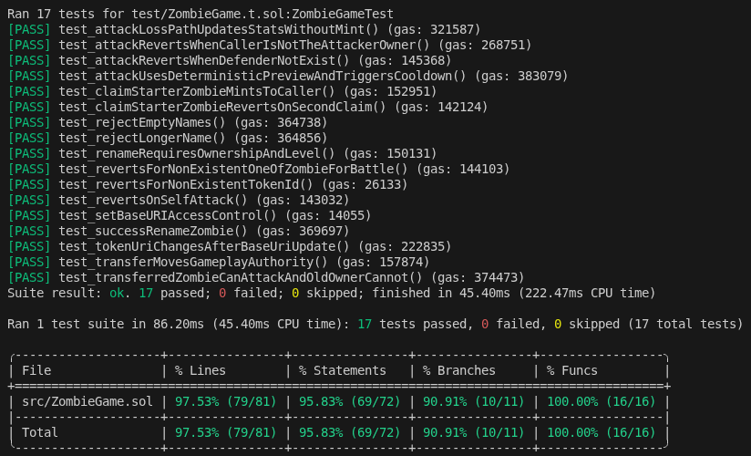
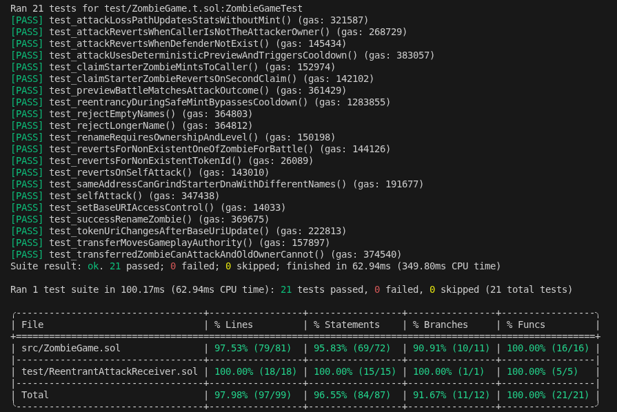

# Zombie Game

This repository is a compact `Solidity/Foundry` rebuild inspired by the original [CryptoZombies.io](https://cryptozombies.io/) idea.

It is **not a tutorial port.**

The goal is to take a simple, tutorial-era concept and rebuild it as a minimal, modern Solidity project with:
- clearer architecture
- test-driven design
- explicit security considerations

This repository is intentionally small to keep tradeoffs visible.

---

## Purpose

This project is a **portfolio case study** demonstrating:
- how to evolve tutorial Solidity into a clean MVP
- how to design contracts with testing in mind from the start
- why security testing is fundamentally different from functional testing

A key idea behind this repo → High coverage does not mean high confidence.

---

## What Was Modernized

Compared to the original tutorial approach:
- upgraded to Solidity `0.8.24`
- replaced inheritance-heavy structure with a single focused contract
- replaced custom logic with OpenZeppelin (`ERC721`, `Ownable`)
- removed tutorial abstractions that add noise without value
- simplified state transitions for better testability
- avoided premature "V2" features

---

## Design Philosophy

The project follows strict constraints:
- readable > clever
- compact > over-engineered
- testable > feature-rich
- explicit tradeoffs > fake production assumptions

### Deterministic Combat

Combat is intentionally deterministic.

Using insecure randomness (e.g., block data) would make the game look more realistic but introduce misleading assumptions.

Determinism:
- improves auditability
- simplifies reasoning
- exposes limitations clearly

---

## Architecture

Core contract:
- `src/ZombieGame.sol`
  - ERC721-based ownership
  - one starter zombie per address
  - stats and progression
  - cooldown-based attacks
  - deterministic combat
  - level-gated rename

Tests:
- `test/ZombieGame.t.sol`
  - functional tests
  - revert & authorization tests
  - security-oriented tests
- `test/ReentrantAttackReceiver.sol`
  - helper contract for reentrancy scenarios

---

## Testing Philosophy

This repository exists to demonstrate a critical point → **Happy-path coverage can look complete while missing real risk**.

The test suite is structured into:
- functional tests
- revert / authorization tests
- security-oriented tests

Security tests focus on:
- adversarial flows
- unexpected state transitions
- callback surfaces
- assumption breaking

### Coverage vs Reality

You can compare:
- coverage with only functional tests
- coverage after adding security tests

The percentage increase may be small.

The **risk reduction is not**.

### Coverage Comparison
Coverage functional tests:



Coverage functional plus security tests:



Even with little or no coverage delta, the second version significantly increases confidence.

---

## Security Observations

This is an MVP and not production-ready.

Important behaviors:
- deterministic combat → fully predictable outcomes
- starter DNA can be optimized offchain (name grinding)
- `_safeMint` introduces a **reentrancy surface via callbacks**

This is intentional:
- the repo demonstrates *where risks appear*
- not just how to eliminate them

Some tests **highlight weaknesses**, not prove safety.

---

## Known Limitations

Deliberately excluded:
- secure randomness (VRF / commit-reveal)
- external integrations
- full game economy
- upgradeability
- advanced gameplay modules

Reason: preserve clarity of the core system.

---

## Commands
```
forge build
forge test
forge coverage
```
If cloning with submodules:
```
git submodule update --init --recursive
```

## What This Repository Demonstrates
- Why ~100% coverage can still miss vulnerabilities
- How to design tests beyond happy paths
- How reentrancy can appear even in simple logic
- How to think in terms of adversarial flows, not user flows
